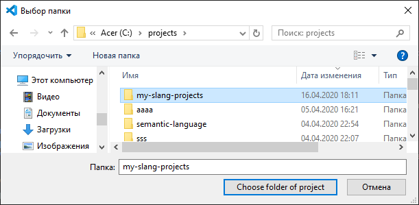
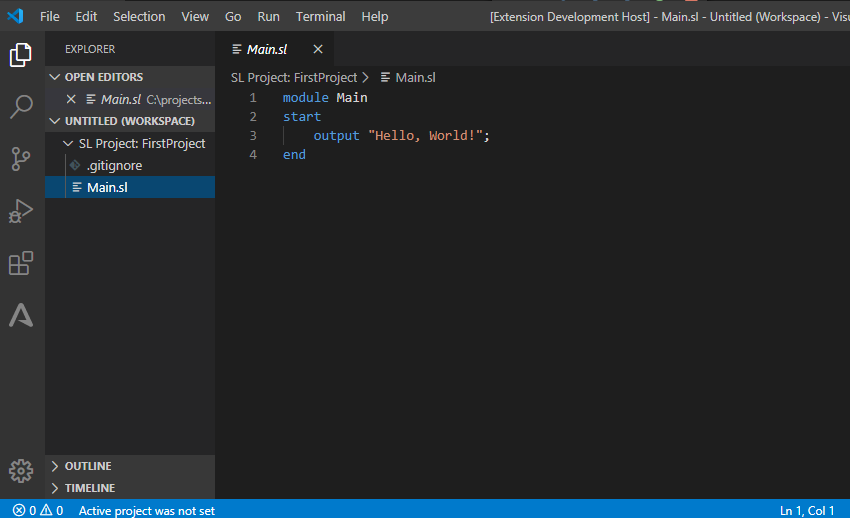
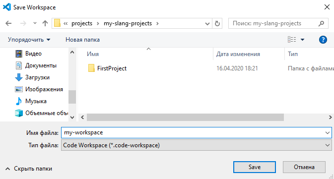

# Описание системы "SLang IDE"

Интегрированная среда **SLang IDE** — это автоматизированная система, состоящая из:

*   Компилятора учебного языка SLang (Slang, Semantic Language)
*   Плагина к текстовому редактору Visual Studio Code

На данный момент, компилятор поставляется вместе с плагином, однако его можно использовать отдельно от среды как консольное приложение (см. раздел "Дополнительно")

Для работы компилятора необходим .NET Core Runtime версии не ниже 3.1.1 и компилятор языка C++!

# Быстрый старт

Перед началом работы с интегрированной средой лучше всего создать рабочее окружение — workspace. Workspace — это рабочее пространство, которое состоит из некоторого множества директорий, в которых и находятся проекты на языке SLang.

Самый удобный способ для начала работы со средой:

*   Создать директорию, где будут находиться все ваши проекты. Для примера, этой директорией будет `C:\projects\my-slang-projects`
*   Нажать клавишу `F1` и найти в выпадающем списке команду `SL: Create new project in current workspace`(создать проект в текущем рабочем окружении)  
      
    Кликните на команду в списке, чтобы выполнить её
*   В появившемся текстовом поле ввести название проекта (допустим, это будет FirstProject)  
    
*   Подтвердить ввод нажатием клавиши `Enter`
*   В диалоговом меню выбрать директорию с проектом и нажать на кнопку `Choose folder of project`  
    
*   В случае, если все было выбрано верно, меню редактора примет следующий вид:  
    
*   Теперь нам нужно сохранить рабочее окружение, чтобы пользоваться его настройками (о них будет написано позднее). Выберите команду `File->Save workspace as...` Сохраните файл настроек в корневой папке вашего окружения (в примере это `C:\projects\my-slang-projects`)  
    
*   Последний шаг для настройки работы — указать созданный проект как стартовый (именно его мы будем собирать и запускать). Для этого нажмите клавишу `F1` и найдите команду `SL: Set active project`  
      
    Запустите команду на выполнение
*   Выбор проекта осуществляется кликом на его название в выведенном списке  
    
*   Теперь в строке состояния снизу можно увидеть путь до текущего активного проекта  
    

Для открытия вашего workspace воспользуйтесь соответствующим пунктом меню ```File->Open workspace...```

# Возможности расширения

## Подсветка синтаксиса

Расширение имеет поддержку базовой подсветки синтаксиса, а именно базовых ключевых слов и литералов (чисел, строк)

## Сниппеты

Для некоторых ключевых слов (например, variable) доступны сниппеты — готовые фрагменты исходного кода, которые можно изменять. Это позволяет минимизировать ошибки в исходном коде (нам пришлось бы набирать инструкции кода вручную). На данный момент доступны самые основные сниппеты (объявление переменной простых типов, масссивов, указателей и другие основные конструкции). 

Для выбора сниппета введите соответствующее слово (или его первые несколько букв) и выберите подходящий сниппет из списка


Перемещаться по частям сниппета можно, используя клавишу `Tab`. Синем фоном выделена текущая часть сниппета, которая будет редактироваться


 Список сниппетов будет обновляться в будущем

### Список сниппетов по ключевым словам
* ```let``` 
  * Присваивание
* ```module```
  * Главный модуль
  * Обычный модуль
* ```variable```
  * Объявление переменной
  * Объявления поля модуля
* ```const```
  * Объявление констант
  * Объявление полей-констант
* ```while```
* ```repeat```
* ```function``` и ```procedure```
  * Обычные
  * Методы
  * Абстрактные методы
* ```if```
  * без блоков ```elseif``` и ```else```
  * с блоком ```else```
  * с блоками ```elseif``` и ```else```
* ```array```
  * Объявление переменной-массива
* ```pointer```
  * Объявление указателя
* ```val``` и ```ref``` — для соответствующих параметров функций и процедур

## Сборка и запуск

Возможность сборки и запуска проектов реализована в виде задач (Tasks)

В VSCode можно создать различные типы задач, такие как задачи сборки или запуска тестов

Получить список задач сборки можно с помощью сочетания `Ctrl+Shift+B`, а список всех задач — через меню `Terminal->Run Tasks`. На данный момент доступна одна задача сборки, которую можно сделать задачей по умолчанию (см. пункт "Дополнительно")

Для сборки активного проекта достаточно нажать сочетание клавиш `ctrl+f9`, которое само выполнит указанную задачу без приведенных выше шагов

Для запуска собранной программы достаточно нажать сочетание клавиш `ctrl+f10`

**Важно!** Запуск программы (с отладкой и без) из редактора (сочетания f5 и ctrl+f5) на данный момент не реализованы.

## Команды расширения

Команды VSCode отличаются от задач тем, что последние запускают какой-то внешний процесс, а команды оперируют функционалом, который и поставляет редактор или его расширения

На данный момент для SLangIDE доступно 4 команды (получить список всех команд редактора можно, нажав клавишу F1)

*   `SL: Create new project in current workspace` — Создание проекта в текущем Workspace (при его отсутствии будет созданно временное окружение)
*   `SL: Show Help` — Вывод справки с помощью по работе с системой (которую Вы сейчас читаете)
*   `SL: Set active project` — Указание активного проекта (который будет собираться и запускаться)
*   `SL: Show examples workspace` — Открывает в новом окне рабочее пространство с примерами программ, поставляемое вместе с компилятором языка SLang
*   `SL: Show language help` — Вывод краткой справки по языку
*   `SL: Show standard lib help` — Вывод краткой справки по стандартной библиотеке

# Дополнительно

## Использование компилятора отдельно от среды

Компилятор языка SLang может использоваться как консольное приложение. Собранный исполняемый файл находится в директории bin, которая находится в директории с установленным расширением (для Windows `\Users\USERNAME\.vscode\extensions`)

Аргументы командной строки —

*   Путь к директории проекта
*   Путь к директории для оттранслированных файлов
*   Язык (В данный момент доступен только один — "cpp")
*   Путь к исполняемому файлу

## Возможные трудности

*   В некоторых случаях программа при запуске на ctrl+f10 может не запуститься. Это может быть вызвано тем, что в терминале по умолчанию находится нестандартная оболочка (напр. PowerShell). Перейдите к пункту `Terminal` в окне снизу и в выпадающем списке выберите `Select Default Shell`. В выпадающем списке выберите терминал по умолчанию в вашей ОС (для Windows это будет `cmd`).
*   Стоит отметить, что среда делает проверку обновлений компилятора при запуске среды, и при отсутствии Интернета выводится соответствующее сообщение.

## Перенос workspace на другие ПК

В случае переноса workspace на другой ПК необходимо будет изменить абсолютные пути. В случае, если все проекты находятся в одной папке, как и показано в секции "Быстрый старт", то единственный путь, который необходимо поменять — это путь к активному проекту, который всегда хранится как абсолютный путь. Для этого необходимо выполнить команду установки активного проекта ещё раз.

## Настройка задач сборки по умолчанию (не актуально)

Для того, чтобы не выбирать задачу для сборки каждый раз, можно настроить задачу по умолчанию `Terminal->Configure Default Build Task`

## Исходный код

Лицензия MIT:

*   [Расширение](https://github.com/NothingIsGood/Semantic-Language-Extension)
*   [Компилятор](https://github.com/NothingIsGood/SlangCompilier)